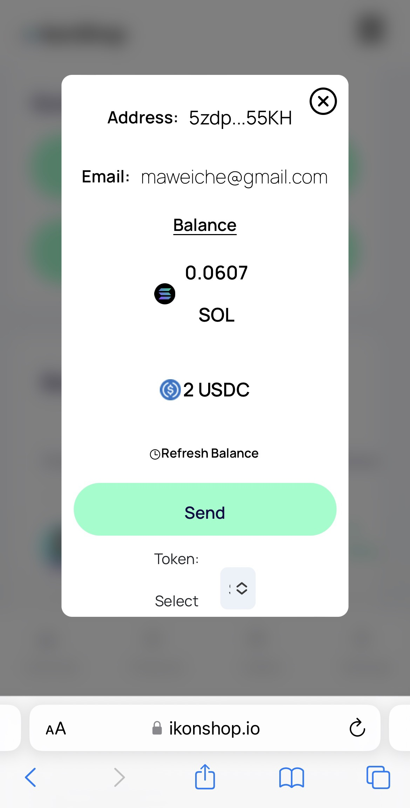
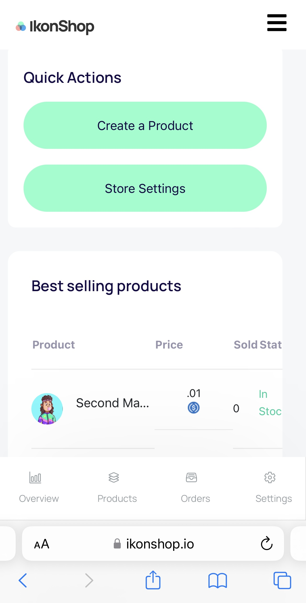

# IkonShop - A web3 platform for merchants and freelancers. 

**This repo is intended for the Solana Grizzlython only.**

[Live Site](https://www.ikonshop.io)

## About

IkonShop was created with the idea of giving merchants an ability to accept Solana Tokens as payment for their products. From their the vision expanded into a one-stop shop for merchants and users combined.

With our Email Wallet capabilities, users can access their Solana wallet in any mobile browser.

The email wallet is linked to a **Helius** websocket that updates the balances any time there is a change on the account.

All transactions are recorded in an external GQL Database while levereaging **Solana FM** to fully display detailed transaction data.

Our platform allows users to register as merchants and sell their own products (physical or digital). Users can also generate pay request links and tip jars (like buy me a coffee). From there they can easily manage all orders.

When a user becomes a merchant, they instantly receive a store based on their entered Store Name and can display their products under a dedicated url.

## Whats Next?

IkonShop plans to continue building after the completion of Grizlthon. Features we anticipate releasing in the near future are:

-- API Docs to externally list a merchant's products
-- Embeddable Tip Jars to allow your audience to tip from anywhere
-- User Profile pages (can anyone say Myspace on Solana??)

## Contributing

If interested in contributing, reach out to the team on Discord!

## License

This project is licensed under the MIT License

## Contact
[IkonShop Twitter](https://twitter.com/ikonshopapp)

[IkonShop Discord](https://discord.gg/ikons)

## Acknowledgments
[Matt Weichel](https://twitter.com/topshotturtles)

[Mike Kruz](https://twitter.com/kruzsol)

[Henry Ugo](https://twitter.com/uncensored_ugo)

